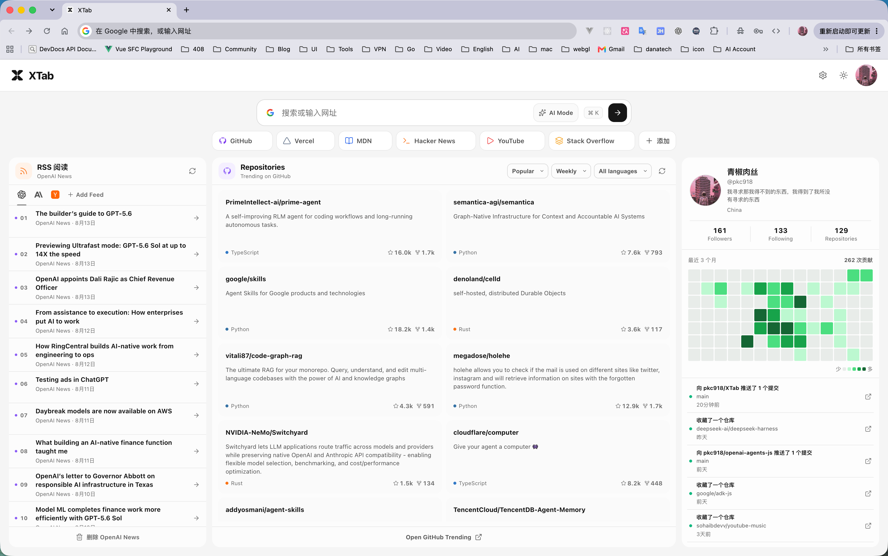

XTab is a new tab extension built for developers and geeks.

<p align="center">
  <a href="https://linux.do/"></a>
</p>

## Features

### Search and shortcuts

- Search with Google or enter a URL to open a website directly.
- Search with Google AI Mode.
- Press `⌘ K`, `Ctrl K`, or `/` to focus the search box.
- Add and remove custom website shortcuts, stored locally by the extension.

### RSS reader

- Includes OpenAI News and Claude Code updates by default.
- Add or remove feeds directly from the RSS panel.
- Supports RSS 0.9x/2.0, RSS 1.0 (RDF), Atom, and JSON Feed 1.0/1.1.
- Handles common Content, Dublin Core, Media RSS, and enclosure fields.
- Uses icons declared by feeds when available, falls back to the site favicon, and safely displays the source name if neither icon can be loaded.
- Supports concurrent refreshes, request timeouts, content size limits, article deduplication, and ETag/Last-Modified conditional requests.

### GitHub repository discovery

- `Popular`: browse repositories from GitHub Trending.
- `New`: discover recently created repositories gaining attention.
- Filter either feed by `Daily`, `Weekly`, or `Monthly`, as well as by programming language.
- Repository cards show the description, language, stars, and forks, with direct links to GitHub.

### GitHub profile

- Sign in through GitHub Device Flow without bundling a Client Secret in the extension.
- View your avatar, public profile, repository count, and follower statistics.
- See your GitHub contribution activity and recent public events.
- Restore an existing session or disconnect at any time.

### Interface

- Light and dark themes.
- A compact, single-page layout for quick actions and content discovery.
- Clear loading, empty, error, and refresh states.

## Tech stack

- [WXT](https://wxt.dev/)
- [Vue 3](https://vuejs.org/)
- [TypeScript](https://www.typescriptlang.org/)
- [Lucide](https://lucide.dev/)
- [pnpm](https://pnpm.io/)

## Local development

### 1. Install dependencies

```bash
pnpm install
```

### 2. Configure environment variables

Copy the example environment file:

```bash
cp .env.example .env.local
```

To enable GitHub sign-in, create a GitHub App or OAuth App with Device Flow enabled and provide its public Client ID:

```dotenv
WXT_GITHUB_CLIENT_ID=your_client_id
```

A Client Secret is neither required nor safe to include in the extension.

### 3. Start the development server

```bash
pnpm dev
```

For Firefox development:

```bash
pnpm dev:firefox
```

## RSS source configuration

In addition to using `Add Feed` in the interface, you can preconfigure extra sources with `WXT_RSS_FEED_URLS` in `.env.local`.

Separate multiple URLs with commas or newlines:

```dotenv
WXT_RSS_FEED_URLS=https://example.com/rss.xml,https://example.org/atom.xml
```

To specify display names or categories, use a single-line JSON array:

```dotenv
WXT_RSS_FEED_URLS=[{"url":"https://example.com/feed.json","title":"Example Feed","category":"开发"}]
```

Source objects support the following fields:

| Field | Required | Description |
| --- | --- | --- |
| `url` | Yes | RSS, Atom, or JSON Feed URL |
| `title` | No | Source name displayed in the interface |
| `category` | No | One of `开发`, `设计`, or `AI` |

When a user-added domain is accessed for the first time, the browser requests permission for that website. XTab does not request access to every website during installation.

## Build and checks

Run the TypeScript type check:

```bash
pnpm compile
```

Build the Chrome extension:

```bash
pnpm build
```

Build the Firefox extension:

```bash
pnpm build:firefox
```

Create distributable archives:

```bash
pnpm zip
pnpm zip:firefox
```

Build artifacts are written to `.output/`.

## Permissions and data

XTab requests only the permissions needed by its features:

- `storage`: saves website shortcuts, RSS sources, and the GitHub session.
- `clipboardWrite`: copies the device code during GitHub Device Flow sign-in.
- GitHub, OpenAI, and Claude Code host permissions: reads public content required by built-in features.
- Other host permissions: granted only when the user adds and authorizes an RSS source from that website.

The GitHub access token is stored in the extension's local storage and restricted to trusted extension contexts. Regular web pages cannot access it. XTab never requires a Client Secret in its source code or build artifacts.

## Project structure

```text
components/newtab/   New tab interface components
composables/         GitHub auth, profile, repositories, and RSS logic
entrypoints/newtab/  New tab entry point, state orchestration, and styles
public/              Extension icons and brand assets
utils/               URL and website shortcut utilities
```

## Version

Current release: `v1.0.0`.
